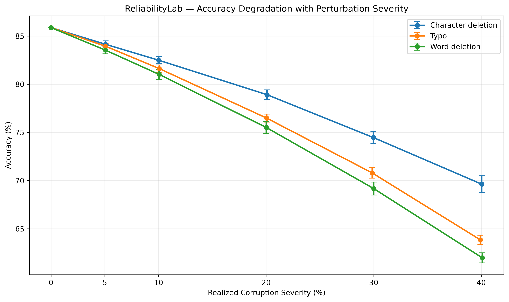
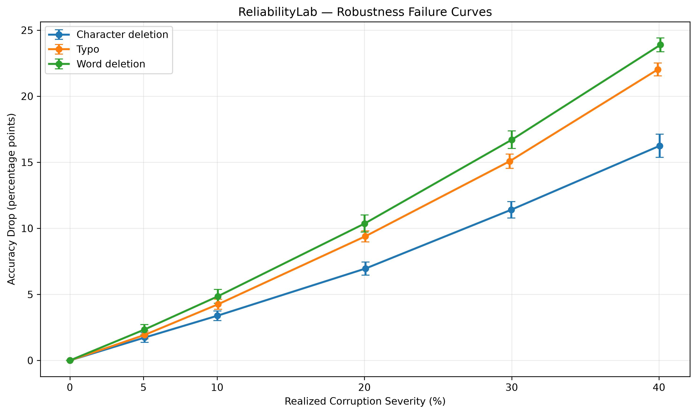

# ReliabilityLab

**Benchmark AI models beyond clean accuracy.**

ReliabilityLab is an open-source experimental framework for evaluating the **stability, robustness, and reproducibility** of machine-learning and NLP systems.

Rather than asking only:

> *What is the model's best accuracy?*

ReliabilityLab asks:

> *How stable is that performance? What happens when training data becomes scarce? What happens when real-world inputs are corrupted? Does a more complex model actually become more reliable?*

The current release focuses on **intent classification using BANKING77**, comparing a classical **TF-IDF + Logistic Regression** baseline with a fine-tuned **DistilBERT** transformer.

---

## Why ReliabilityLab?

Standard evaluation often compresses model quality into a single number:

```text
Accuracy = 92.4%
```

That number does not tell us:

* whether the result is stable across different data samples;
* whether it depends on a favourable random draw;
* how the model behaves under input corruption;
* how quickly performance fails as noise increases;
* whether a more sophisticated model is actually more robust;
* how much computational cost was required to obtain the result.

ReliabilityLab treats these as first-class evaluation dimensions.

---

# Current Capabilities

ReliabilityLab currently supports:

* repeated stratified training-subset experiments;
* training-data sensitivity analysis;
* mean, standard deviation, range and confidence intervals;
* Peak–Mean Gap analysis;
* text perturbation generation;
* probabilistic perturbation severity;
* typo robustness;
* character-deletion robustness;
* word-deletion robustness;
* casing and punctuation controls;
* repeated stochastic perturbation evaluation;
* progressive failure curves;
* paired cross-model robustness comparison;
* classical and transformer model baselines;
* CSV and JSON experiment logging;
* publication-quality visualisations.

---

# Experimental Setup

## Dataset

**BANKING77**

* 10,003 training queries
* 3,080 test queries
* 77 banking intent classes

The project currently uses the script-free Hugging Face mirror:

```text
DeepPavlov/banking77
```

---

## Models

### TF-IDF + Logistic Regression

Features:

```text
lowercase = True
ngram_range = (1, 2)
min_df = 2
sublinear_tf = True
```

Classifier:

```text
Logistic Regression
solver = lbfgs
max_iter = 2000
```

### DistilBERT

Base model:

```text
distilbert-base-uncased
```

Fine-tuning configuration:

```text
epochs            = 3
learning rate     = 2e-5
train batch size  = 16
eval batch size   = 32
max sequence      = 64
seed              = 42
device            = CPU
```

---

# Key Result

Under the evaluated configurations, increased model complexity did **not** translate into improved clean accuracy or perturbation robustness.

## Clean Performance

| Model                            |   Accuracy |   Macro F1 |
| -------------------------------- | ---------: | ---------: |
| **TF-IDF + Logistic Regression** | **85.88%** | **85.81%** |
| DistilBERT                       |     85.06% |     84.24% |

DistilBERT required approximately **157.64 minutes** of CPU training for three epochs.

The clean DistilBERT result currently represents one training seed and should not be interpreted as a population-level model comparison.

---

# Robustness at 20% Corruption

Each perturbation condition was evaluated using **10 matched stochastic perturbation realizations**.

| Perturbation       |   TF-IDF Accuracy | DistilBERT Accuracy | TF-IDF Advantage |
| ------------------ | ----------------: | ------------------: | ---------------: |
| Typo               | **76.48 ± 0.42%** |       68.51 ± 0.51% |     **+7.97 pp** |
| Character deletion | **78.92 ± 0.50%** |       73.92 ± 0.43% |     **+5.00 pp** |
| Word deletion      | **75.51 ± 0.64%** |       69.64 ± 0.44% |     **+5.87 pp** |

---

## Robustness Degradation

Performance loss relative to each model's own clean baseline:

| Perturbation       |  TF-IDF Drop | DistilBERT Drop |
| ------------------ | -----------: | --------------: |
| Typo               |  **9.40 pp** |        16.55 pp |
| Character deletion |  **6.95 pp** |        11.15 pp |
| Word deletion      | **10.36 pp** |        15.42 pp |

DistilBERT therefore experienced additional degradation of:

```text
Typo              +7.16 pp
Character delete  +4.19 pp
Word delete       +5.06 pp
```

under the evaluated 20% corruption conditions.

---

# Paired Statistical Comparison

The same perturbation seeds were used for both models, allowing a paired comparison.

| Perturbation       | Mean TF-IDF Advantage |       95% CI | Paired p-value |
| ------------------ | --------------------: | -----------: | -------------: |
| Typo               |          **+7.97 pp** | [7.47, 8.46] |   4.27 × 10⁻¹¹ |
| Character deletion |          **+5.00 pp** | [4.56, 5.45] |    1.09 × 10⁻⁹ |
| Word deletion      |          **+5.87 pp** | [5.52, 6.22] |   2.95 × 10⁻¹¹ |

These tests quantify differences under the current paired perturbation design. They should not be interpreted as evidence that TF-IDF is universally superior to transformer models.

---

# Training-Data Sensitivity

ReliabilityLab also measures how performance changes when only a fraction of the available training data is used.

| Training Data | Mean Accuracy |        SD |
| ------------: | ------------: | --------: |
|           20% |        71.45% |   0.64 pp |
|           40% |        79.26% |   0.48 pp |
|           60% |        82.64% |   0.42 pp |
|           80% |        84.73% |   0.32 pp |
|          100% |        85.88% | Reference |

The 20–80% conditions use ten stratified training subsets.

The 100% condition is a deterministic full-data reference and is therefore not treated as a repeated-sampling variance estimate.

The experiment shows two simultaneous effects:

1. predictive performance increases with training-data availability;
2. sensitivity to training-subset composition decreases as more data becomes available.

---

# Progressive Robustness Failure

ReliabilityLab uses probabilistic perturbations so that requested corruption severity closely matches the realized corpus-level corruption rate.

The current severity sweep evaluates:

```text
5%
10%
20%
30%
40%
```

for:

```text
Typographical swaps
Character deletion
Word deletion
```

## TF-IDF Accuracy

| Severity | Character Delete |   Typo | Word Delete |
| -------: | ---------------: | -----: | ----------: |
|    Clean |           85.88% | 85.88% |      85.88% |
|       5% |           84.14% | 83.95% |      83.54% |
|      10% |           82.49% | 81.62% |      81.03% |
|      20% |           78.92% | 76.48% |      75.51% |
|      30% |           74.47% | 70.80% |      69.17% |
|      40% |           69.63% | 63.85% |      61.99% |

This allows ReliabilityLab to study **how quickly a model fails**, rather than evaluating robustness at only one arbitrary noise level.

---

# Figures

## Progressive Accuracy Degradation



## Robustness Failure Curves



Additional model-comparison and data-stability figures are generated by the analysis scripts in `notebooks/`.

---

# Experimental Philosophy

ReliabilityLab separates several concepts that are often conflated.

## Clean Performance

How accurately does the model classify the original benchmark?

## Data Sensitivity

How strongly does performance depend on which training samples happen to be available?

## Perturbation Robustness

How much performance is lost when realistic input corruption is introduced?

## Perturbation Variability

Does the result depend heavily on the exact random corruption realization?

## Severity Response

How rapidly does performance degrade as corruption becomes stronger?

## Computational Cost

How much computation is required to obtain the reported result?

The long-term goal is to evaluate these dimensions jointly rather than treating clean benchmark accuracy as a sufficient description of model quality.

---

# Repository Structure

```text
ReliabilityLab/
│
├── src/
│   └── reliabilitylab/
│       ├── data/
│       ├── models/
│       ├── experiments/
│       ├── metrics/
│       ├── perturbations/
│       ├── reporting/
│       └── utils/
│
├── notebooks/
│   ├── 01_dataset_exploration.py
│   ├── 02_tfidf_baseline.py
│   ├── 03_repeated_subsample.py
│   ├── 04_data_stability_sweep.py
│   ├── 05_plot_data_stability.py
│   ├── 06_text_robustness.py
│   ├── 07_inspect_perturbations.py
│   ├── 08_repeated_robustness.py
│   ├── 09_plot_robustness.py
│   ├── 10_robustness_severity.py
│   ├── 11_probabilistic_severity.py
│   ├── 12_plot_probabilistic_severity.py
│   ├── 13_distilbert_baseline.py
│   ├── 14_distilbert_robustness.py
│   ├── 15_distilbert_repeated_20pct.py
│   └── 16_compare_models.py
│
├── results/
│   ├── robustness/
│   ├── comparison/
│   ├── data_stability/
│   ├── figures/
│   └── distilbert/
│
├── tests/
├── configs/
├── docs/
├── assets/
├── pyproject.toml
├── README.md
└── LICENSE
```

---

# Installation

ReliabilityLab currently targets Python 3.12.

Clone the repository:

```bash
git clone https://github.com/MBobie/ReliabilityLab.git
cd ReliabilityLab
```

Create and synchronize the environment:

```bash
uv sync
```

Confirm Python:

```bash
uv run python --version
```

---

# Reproducing the Main Experiments

## TF-IDF baseline

```bash
uv run python notebooks/02_tfidf_baseline.py
```

## Training-data sensitivity

```bash
uv run python notebooks/04_data_stability_sweep.py
```

## Basic robustness evaluation

```bash
uv run python notebooks/06_text_robustness.py
```

## Repeated TF-IDF robustness

```bash
uv run python notebooks/08_repeated_robustness.py
```

## Probabilistic severity experiment

```bash
uv run python notebooks/11_probabilistic_severity.py
```

## DistilBERT training

```bash
uv run python notebooks/13_distilbert_baseline.py
```

> **Note:** DistilBERT training is substantially more computationally expensive than the classical baseline. The reported three-epoch CPU run required approximately 158 minutes on the development machine.

## Repeated DistilBERT robustness evaluation

```bash
uv run python notebooks/15_distilbert_repeated_20pct.py
```

## Paired cross-model analysis

```bash
uv run python notebooks/16_compare_models.py
```

---

# Current Interpretation

The current experiments support a deliberately narrow conclusion:

> **For BANKING77 under the evaluated configurations, greater model complexity did not guarantee greater reliability. TF-IDF + Logistic Regression slightly exceeded DistilBERT in clean performance and exhibited substantially smaller degradation under matched text-corruption conditions.**

This should **not** be interpreted as evidence that classical models universally outperform transformers.

The purpose of ReliabilityLab is precisely to make such conditional statements measurable and reproducible.

---

# Limitations

The current release is a research prototype.

Important limitations include:

* experiments currently focus on one dataset;
* only two model families have been compared;
* the reported DistilBERT clean baseline uses one training seed;
* perturbation coverage is still limited;
* semantic-preserving transformations require expansion;
* calibration has not yet been evaluated;
* distribution-shift experiments are not yet implemented;
* computational cost tracking is not yet fully automated;
* multiple-comparison corrections and effect-size reporting are still being integrated.

These limitations define the next research milestones rather than being hidden from the evaluation.

---

# Roadmap

## v0.2

* [ ] Add additional intent-classification datasets
* [ ] Add additional classical and transformer baselines
* [ ] Multi-seed neural training
* [ ] Automated compute and runtime tracking
* [ ] Robustness AUC
* [ ] Calibration metrics
* [ ] Effect-size reporting
* [ ] Multiple-comparison correction

## v0.3

* [ ] Distribution-shift evaluation
* [ ] Semantic perturbations
* [ ] Adversarial robustness
* [ ] Model confidence under corruption
* [ ] Nested low-resource experiments

## v0.4

* [ ] RAG reliability
* [ ] LLM evaluation
* [ ] Agent reliability
* [ ] Interactive dashboard
* [ ] MLflow experiment tracking

---

# Research Direction

ReliabilityLab is being developed around a broader research question:

> **When does benchmark performance represent genuine, stable and deployable model behaviour—and when does it hide fragility?**

Future experiments will extend the current framework across datasets, model families, training regimes and deployment conditions.

---

# Citation

ReliabilityLab is currently under active development.

If you use the project in academic work, please cite the repository for now. A formal BibTeX citation will be added with the first archived release and accompanying research paper.

---

# License

Released under the **MIT License**.

---

# Author

**Manuel Bobie Amankwatia**

AI & Data Engineer · AI Researcher

ReliabilityLab is part of ongoing research into robust, reproducible and deployable artificial intelligence systems.
