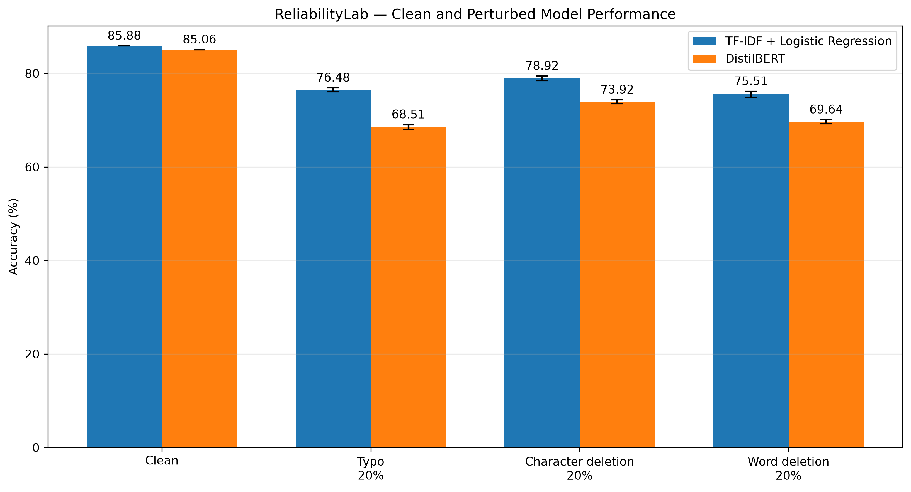
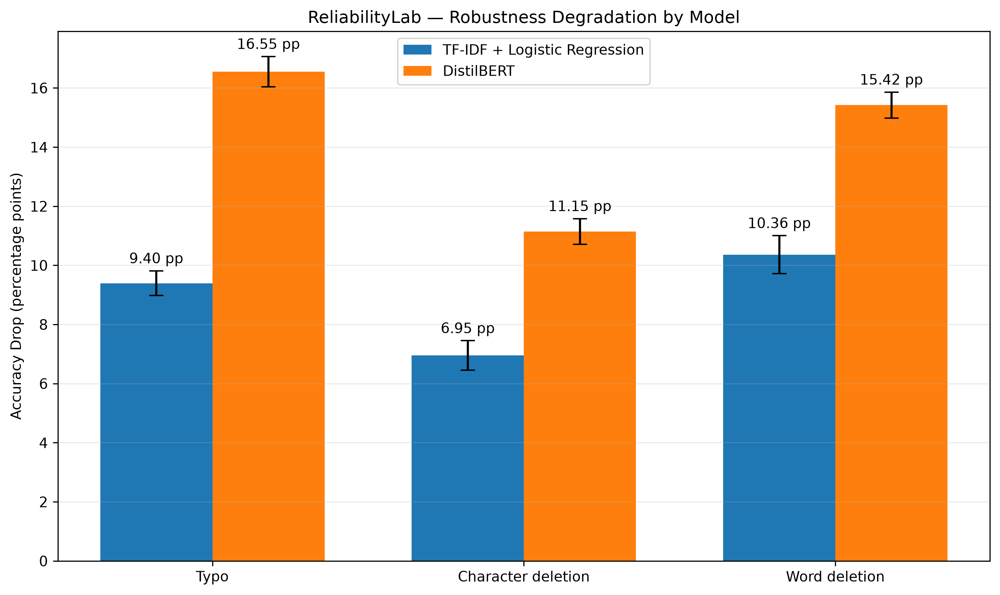
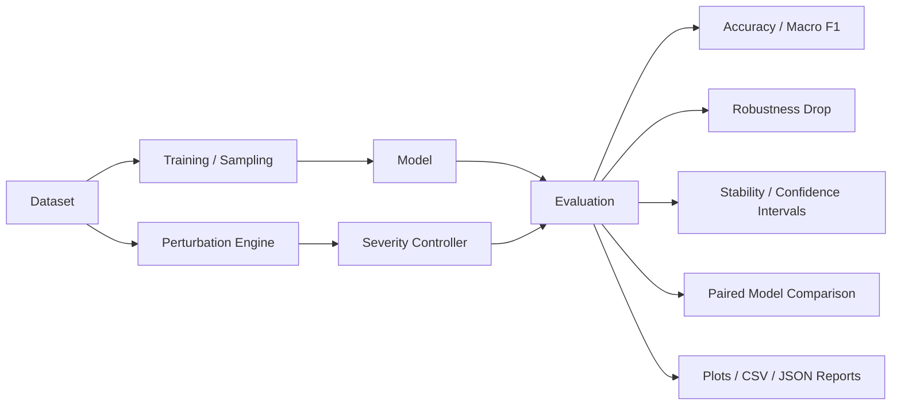

# ReliabilityLab

> **Benchmark AI systems beyond their best clean-accuracy run.**

ReliabilityLab is an open-source experimental framework for measuring **performance stability, data sensitivity, input robustness, uncertainty, and computational cost** in machine-learning and NLP systems.

The first case study evaluates intent classification on **BANKING77**, comparing a classical **TF-IDF + Logistic Regression** baseline with **DistilBERT** under matched stochastic text corruptions.

---

## Why ReliabilityLab?

A single benchmark score can hide important deployment behavior. A model can achieve strong clean accuracy while still being sensitive to training samples, unstable across runs, fragile to noise, poorly calibrated, or computationally expensive relative to its actual gain.

### Core question

> **Does greater model sophistication necessarily imply greater reliability?**

The current BANKING77 case study suggests that the answer can be **no**.

---

## Current Findings

### Clean performance

| Model | Accuracy | Macro F1 |
|---|---:|---:|
| **TF-IDF + Logistic Regression** | **85.88%** | **85.81%** |
| DistilBERT | 85.06% | 84.24% |

DistilBERT was fine-tuned for 3 epochs on CPU and required approximately **157.64 minutes** for training on the development machine.

> The DistilBERT clean result currently comes from one training seed. It should therefore be treated as a configuration-specific baseline rather than a population-level estimate of transformer performance.

### Robustness at 20% corruption

Each perturbation condition was evaluated using **10 matched stochastic perturbation realizations**.

| Perturbation | TF-IDF Accuracy | DistilBERT Accuracy | TF-IDF Advantage |
|---|---:|---:|---:|
| Typo | **76.48 ± 0.42%** | 68.51 ± 0.51% | **+7.97 pp** |
| Character deletion | **78.92 ± 0.50%** | 73.92 ± 0.43% | **+5.00 pp** |
| Word deletion | **75.51 ± 0.64%** | 69.64 ± 0.44% | **+5.87 pp** |

### Robustness degradation

| Perturbation | TF-IDF Drop | DistilBERT Drop | Extra DistilBERT Degradation |
|---|---:|---:|---:|
| Typo | **9.40 pp** | 16.55 pp | **+7.16 pp** |
| Character deletion | **6.95 pp** | 11.15 pp | **+4.19 pp** |
| Word deletion | **10.36 pp** | 15.42 pp | **+5.06 pp** |

### Paired comparison

The same perturbation seeds were used for both models.

| Perturbation | Mean TF-IDF Advantage | 95% CI | Paired p-value |
|---|---:|---:|---:|
| Typo | **+7.97 pp** | [7.47, 8.46] | 4.27 × 10^-11 |
| Character deletion | **+5.00 pp** | [4.56, 5.45] | 1.09 × 10^-9 |
| Word deletion | **+5.87 pp** | [5.52, 6.22] | 2.95 × 10^-11 |

These tests quantify differences across the current matched perturbation realizations. They do **not** establish that TF-IDF is universally superior to transformer models.

---

## Training-Data Sensitivity

| Training Data | Mean Accuracy | SD |
|---:|---:|---:|
| 20% | 71.45% | 0.64 pp |
| 40% | 79.26% | 0.48 pp |
| 60% | 82.64% | 0.42 pp |
| 80% | 84.73% | 0.32 pp |
| 100% | 85.88% | deterministic reference |

The 20–80% conditions use ten stratified subsets. The 100% TF-IDF condition is a single deterministic full-data reference, so its variability is **not estimated**.

---

## Progressive Robustness Failure

Probabilistic perturbations are used so that requested severity closely tracks realized corpus-level corruption.

Current severity levels: **5%, 10%, 20%, 30%, 40%**.

| Severity | Character Delete | Typo | Word Delete |
|---:|---:|---:|---:|
| Clean | 85.88% | 85.88% | 85.88% |
| 5% | 84.14% | 83.95% | 83.54% |
| 10% | 82.49% | 81.62% | 81.03% |
| 20% | 78.92% | 76.48% | 75.51% |
| 30% | 74.47% | 70.80% | 69.17% |
| 40% | 69.63% | 63.85% | 61.99% |

---

## Figures






---

## Reliability Dimensions

ReliabilityLab separates evaluation into multiple dimensions:

- **Clean performance** — benchmark accuracy and Macro F1.
- **Training-data sensitivity** — dependence on which training examples are available.
- **Training-run sensitivity** — variability across stochastic training seeds.
- **Perturbation robustness** — performance loss under corrupted inputs.
- **Perturbation variability** — sensitivity to the exact corruption realization.
- **Severity response** — how quickly performance deteriorates as corruption grows.
- **Calibration** — whether confidence remains meaningful under difficulty or corruption.
- **Computational cost** — training time, inference time, parameters, and hardware demands.

---

## Architecture



---

## Repository Structure

```text
ReliabilityLab/
├── src/reliabilitylab/
│   ├── data/
│   ├── models/
│   ├── experiments/
│   ├── metrics/
│   ├── perturbations/
│   ├── reporting/
│   └── utils/
├── notebooks/
│   ├── 01_dataset_exploration.py
│   ├── 02_tfidf_baseline.py
│   ├── 03_repeated_subsample.py
│   ├── 04_data_stability_sweep.py
│   ├── 05_plot_data_stability.py
│   ├── 06_text_robustness.py
│   ├── 07_inspect_perturbations.py
│   ├── 08_repeated_robustness.py
│   ├── 09_plot_robustness.py
│   ├── 10_robustness_severity.py
│   ├── 11_probabilistic_severity.py
│   ├── 12_plot_probabilistic_severity.py
│   ├── 13_distilbert_baseline.py
│   ├── 14_distilbert_robustness.py
│   ├── 15_distilbert_repeated_20pct.py
│   ├── 16_compare_models.py
│   └── 17_plot_model_comparison.py
├── results/
├── configs/
├── tests/
├── docs/
├── assets/
├── pyproject.toml
├── README.md
└── LICENSE
```

---

## Installation

ReliabilityLab currently targets Python 3.12.

```bash
git clone https://github.com/MBobie/ReliabilityLab.git
cd ReliabilityLab
uv sync
```

Confirm the environment:

```bash
uv run python --version
```

---

## Reproducing the Main Experiments

```bash
# TF-IDF clean baseline
uv run python notebooks/02_tfidf_baseline.py

# Training-data sensitivity
uv run python notebooks/04_data_stability_sweep.py

# Repeated TF-IDF robustness
uv run python notebooks/08_repeated_robustness.py

# Probabilistic severity analysis
uv run python notebooks/11_probabilistic_severity.py

# DistilBERT fine-tuning
uv run python notebooks/13_distilbert_baseline.py

# Repeated DistilBERT robustness
uv run python notebooks/15_distilbert_repeated_20pct.py

# Paired cross-model analysis
uv run python notebooks/16_compare_models.py

# Cross-model figures
uv run python notebooks/17_plot_model_comparison.py
```

---

## Interpretation

> **On BANKING77, under the evaluated configurations, greater model complexity did not guarantee greater reliability. TF-IDF + Logistic Regression slightly exceeded DistilBERT on clean performance and exhibited substantially smaller degradation under matched text-corruption conditions.**

This is **not** evidence that classical models generally outperform transformers.

ReliabilityLab is intended to make model-quality claims **conditional, measurable, statistically explicit, and reproducible**.

---

## Related Work and Positioning

ReliabilityLab is motivated by work arguing that held-out accuracy alone can miss important model failures and that evaluation should incorporate behavioral tests, robustness, and statistical uncertainty.

- **CheckList** — behavioral testing of NLP systems beyond held-out accuracy. Ribeiro et al., ACL 2020: https://aclanthology.org/2020.acl-main.442/
- **TextAttack** — modular adversarial attacks, augmentation, and adversarial training for NLP. Morris et al., EMNLP 2020: https://aclanthology.org/2020.emnlp-demos.16/
- **Deep RL at the Edge of the Statistical Precipice / rliable** — statistically careful evaluation under limited repeated runs. Agarwal et al., NeurIPS 2021: https://arxiv.org/abs/2108.13264

ReliabilityLab's intended contribution is **not** another typo generator. Its direction is to combine training-data sensitivity, stochastic robustness, severity response, calibration, training variability, and computational cost within a unified reproducible workflow for intent-classification evaluation.

---

## Limitations

The current release is a research prototype. Major limitations include:

- one dataset;
- two current model families;
- one DistilBERT training seed;
- limited perturbation families;
- no calibration analysis yet;
- no cross-dataset generalization yet;
- computational cost tracking is not fully automated;
- paired significance tests should be complemented with stronger resampling-based analysis before publication;
- semantic-preservation constraints require further development.

---

## Roadmap

### v0.2 — paper-strength intent-classification evaluation

- [ ] Add CLINC150
- [ ] Add HWU64
- [ ] Add Linear SVM
- [ ] Add at least one neural/hybrid baseline
- [ ] Add a second transformer baseline
- [ ] Repeat stochastic model training across multiple seeds
- [ ] Add calibration metrics
- [ ] Add standardized runtime and inference-time tracking
- [ ] Add effect sizes and multiple-comparison correction
- [ ] Add severity-curve summary statistic
- [ ] Add paired bootstrap or permutation analysis

### v0.3 — broader reliability testing

- [ ] Distribution-shift evaluation
- [ ] Semantic-preserving perturbations
- [ ] Adversarial robustness
- [ ] Confidence-under-corruption analysis
- [ ] Nested low-resource experiments

### v0.4 — generative systems

- [ ] RAG reliability
- [ ] LLM evaluation
- [ ] Agent reliability
- [ ] Interactive dashboard
- [ ] Experiment tracking integration

---

## Research Questions

1. **Can clean-accuracy rankings disagree with reliability-aware model rankings?**
2. **How does training-data availability affect both performance and stability?**
3. **Do more complex models degrade more slowly or more quickly under realistic corruption?**
4. **What is the relationship between reliability, calibration, and computational cost?**

---

## Citation

ReliabilityLab is under active development. A formal citation file and archived release will be added when the first paper-ready benchmark version is completed.

## License

MIT License.

## Author

**Manuel Bobie Amankwatia**  
AI & Data Engineer · AI Researcher
